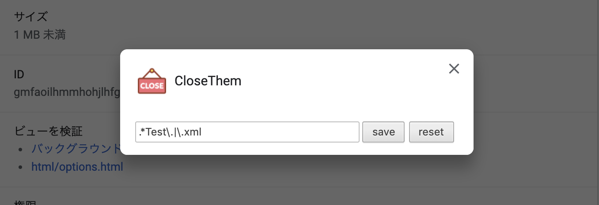

# CloseThem

- Close and open specific items in GitHub `Pull requests > File chenged` page.
- Use regular expressions to decide which files to open and close.
- Configure regular expressions at chrome extension option page.

 

## How to use

1. Do `./make.sh` to create `./chrome-ext-close-them` directory.
2. Import `./chrome-ext-close-them` directory at chrome://extensions page.
3. or Drag & drop it at chrome://extensions page.

